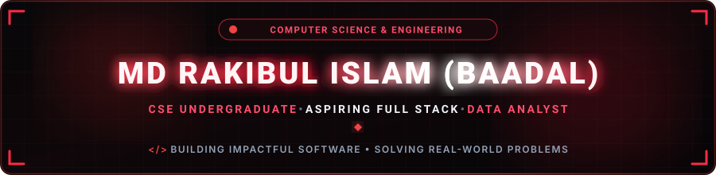
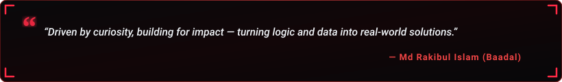

  

  

  
  &nbsp;
  
  &nbsp;
  
  &nbsp;
  
  &nbsp;
  

  

  

<!-- =================================================== -->
<!--                      ABOUT ME                       -->
<!-- =================================================== -->

<h2 align="center">🔴 About Me</h2>

  

  

  Hey! I'm <b>Md Rakibul Islam (Baadal)</b>, an enthusiastic <b>Computer Science & Engineering student and aspiring developer</b> from Bangladesh, currently in my 4th semester at <b>Daffodil International University</b>. 
  I have a strong passion for Full Stack Web Development, Data Structures & Algorithms, Problem Solving, and Data Analytics. I love building real-world projects, solving challenging algorithmic problems, and continuously pushing my technical skills to prepare for competitive internships and professional software engineering roles.

  
  &nbsp;
  
  &nbsp;
  
  &nbsp;
  

  💬 <b>Let's Discuss:</b> C, C++, JavaScript, Web Development, DSA, Problem Solving & Database Systems. 
  ⚡ <b>Career Goal:</b> <i>"To become a professional Full Stack Developer and Data Analyst by mastering Data Structures & Algorithms, building impactful software projects, contributing to open-source, and gaining industry experience through internships and continuous learning."</i>

<table width="100%" border="0" align="center">
  <tr>
    <td width="50%" align="center" style="padding: 14px;">
      <h4>🔭 Flagship Project</h4>
      
<a href="https://github.com/baadaldev" target="_blank"><b>Smart Meal Management System</b></a> Daily meal calculation, balance & expense tracking

    </td>
    <td width="50%" align="center" style="padding: 14px;">
      <h4>🌱 Active Deep Dives</h4>
      
<b>DSA & Problem Solving</b> C++, Algorithms, LeetCode & Backend Development

    </td>
  </tr>
  <tr>
    <td width="50%" align="center" style="padding: 14px;">
      <h4>🎯 Core Objective</h4>
      
<b>Internship & Software Engineering</b> Full Stack Development & Data Analytics

    </td>
    <td width="50%" align="center" style="padding: 14px;">
      <h4>🤝 Collaboration</h4>
      
<b>Web & Software Projects</b> Open to exciting academic & software projects

    </td>
  </tr>
</table>

  

<!-- =================================================== -->
<!--                   CODING JOURNEY                    -->
<!-- =================================================== -->

<h2 align="center">🚀 My Coding Journey &amp; Milestones</h2>

  

  Every software engineering path starts with a spark of genuine curiosity. My programming journey took root approximately <b>7 years ago (February 2019)</b>, when I wrote my very first lines of HTML code on my mobile phone using the <b>SoloLearn</b> platform under the username <code>Badolrakib</code>. What started as pure fascination with structuring forms and seeing markup render on a handheld screen has grown into a focused academic and professional pursuit — starting my <b>B.Sc. in Computer Science & Engineering journey at Daffodil International University on September 12, 2025</b>, solving algorithmic challenges, and crafting full-stack software.

<table width="100%" border="0" align="center">
  <tr>
    <td width="22%" align="center" style="padding: 12px; background: rgba(220, 38, 38, 0.08); border-radius: 8px;">
      
    </td>
    <td width="78%" style="padding: 12px 18px;">
      <h3>🚀 First HTML Code on SoloLearn (7 Years Ago)</h3>
      
Wrote my first HTML experiments on <b>February 26, 2019</b> using SoloLearn on a smartphone. Created custom login and password recovery forms, explored web tags, and discovered the magic of code transforming into visual UI. I still preserve these original screenshots as a badge of honor from where it all started.

      

        
        
        
      

    </td>
  </tr>
  <tr>
    <td colspan="2" align="center">
      
    </td>
  </tr>
  <tr>
    <td width="22%" align="center" style="padding: 12px; background: rgba(220, 38, 38, 0.08); border-radius: 8px;">
      
    </td>
    <td width="78%" style="padding: 12px 18px;">
      <h3>💻 Exploring Technology &amp; Programming</h3>
      
Transitioned from basic markup into computational thinking, software fundamentals, and web architecture. Explored how applications interact, honed self-learning discipline, and set my sights firmly on pursuing Computer Science as my lifelong career.

      

        
        
      

    </td>
  </tr>
  <tr>
    <td colspan="2" align="center">
      
    </td>
  </tr>
  <tr>
    <td width="22%" align="center" style="padding: 12px; background: rgba(220, 38, 38, 0.08); border-radius: 8px;">
      
    </td>
    <td width="78%" style="padding: 12px 18px;">
      <h3>🎓 Started CSE at Daffodil International University (Sept 12, 2025)</h3>
      
Officially embarked on my formal B.Sc. in Computer Science &amp; Engineering journey at Daffodil International University on <b>September 12, 2025</b>. Elevated self-taught passion into rigorous computer science theory, structured programming paradigms, discrete mathematics, and software engineering methodologies.

      

        
        
        
        
      

    </td>
  </tr>
  <tr>
    <td colspan="2" align="center">
      
    </td>
  </tr>
  <tr>
    <td width="22%" align="center" style="padding: 12px; background: rgba(220, 38, 38, 0.08); border-radius: 8px;">
      
    </td>
    <td width="78%" style="padding: 12px 18px;">
      <h3>🔥 Learning C, C++, Data Structures &amp; Algorithms</h3>
      
Dived deep into memory pointers, OOP concepts, standard data structures (Arrays, Linked Lists, Stacks, Queues, Trees), and algorithmic complexity. Solving competitive programming problems actively on LeetCode to build razor-sharp problem-solving instincts.

      

        
        
        
      

    </td>
  </tr>
  <tr>
    <td colspan="2" align="center">
      
    </td>
  </tr>
  <tr>
    <td width="22%" align="center" style="padding: 12px; background: rgba(220, 38, 38, 0.08); border-radius: 8px;">
      
    </td>
    <td width="78%" style="padding: 12px 18px;">
      <h3>🌐 Web Development Journey &amp; Software Systems</h3>
      
Applying algorithmic foundations into building scalable, real-world software applications. Engineered practical systems such as the <i>Smart Meal Management System</i> and <i>Student Management System</i> using modern JavaScript, responsive interfaces, and relational database systems.

      

        
        
        
      

    </td>
  </tr>
  <tr>
    <td colspan="2" align="center">
      
    </td>
  </tr>
  <tr>
    <td width="22%" align="center" style="padding: 12px; background: rgba(220, 38, 38, 0.08); border-radius: 8px;">
      
    </td>
    <td width="78%" style="padding: 12px 18px;">
      <h3>🎯 Future Goal: Web Developer &amp; Data Analyst</h3>
      
Bridging full-stack software engineering with data-driven decision making. Actively preparing for competitive software engineering internships, contributing to impactful open-source projects, and expanding expertise into data analytics to build high-performance systems.

      

        
        
        
      

    </td>
  </tr>
</table>

  

<!-- =================================================== -->
<!--              MY FIRST CODING MEMORIES               -->
<!-- =================================================== -->

<h2 align="center">✨ My First Coding Memories</h2>

  <i>"Every senior engineer once wrote their very first line of code with wonder and curiosity."</i>

  Back in <b>February 2019 (over 7 years ago)</b>, before university and without a sophisticated development environment, I wrote my earliest HTML code on a mobile smartphone using the <b>SoloLearn</b> app under the username <code>Badolrakib</code>. These preserved screenshots capture that memorable beginning — from experimenting with password recovery form tags to building my first project repository.

<table width="100%" border="0" align="center">
  <tr>
    <td width="33.33%" align="center" valign="top" style="padding: 10px;">
      
        
      <b>📱 The First Lines of Code</b> 
      <b>Date:</b> Feb 26, 2019 (23:26) 
      Writing custom HTML form tags, input elements &amp; buttons directly on a mobile screen.
    </td>
    <td width="33.33%" align="center" valign="top" style="padding: 10px;">
      
        
      <b>📂 Early Project Archives</b> 
      <b>Projects:</b> Beginner!!, Hacking, 2019 Codes 
      My early SoloLearn repository archiving initial code experiments from 7 years ago.
    </td>
    <td width="33.33%" align="center" valign="top" style="padding: 10px;">
      
        
      <b>🌐 The First Rendered Output</b> 
      <b>Result:</b> Live Mobile UI Form 
      The electrifying moment my handwritten HTML code rendered visually on screen!
    </td>
  </tr>
</table>

  💡 <i>These screenshots are an irreplaceable reminder that consistency, genuine curiosity, and humble beginnings can evolve into true engineering capability.</i>

  

<!-- =================================================== -->
<!--                 FEATURED PROJECTS                   -->
<!-- =================================================== -->

<h2 align="center">🔴 Featured Projects Spotlight</h2>

<table width="100%" border="0" align="center">
  <tr>
    <td align="center" style="padding: 22px;">
      <h3>🍽️ Smart Meal Management System</h3>
      
<i>A comprehensive web and software management solution designed to streamline daily meal counting, member accounts, expense calculations, and transparent monthly budgeting.</i>

       
      <h3>🎓 Student Management System</h3>
      
<i>A structured academic management application developed to organize student records, course information, enrollment details, and academic data operations seamlessly.</i>

       
      <h3>🧩 Data Structures &amp; Algorithms Practice Repository</h3>
      
<i>A dedicated repository archiving solutions to algorithmic challenges, standard data structures implementations, and problem-solving milestones in C++ and JavaScript.</i>

       
      

        
      

    </td>
  </tr>
</table>

  

<!-- =================================================== -->
<!--                LEETCODE PROBLEM SOLVING             -->
<!-- =================================================== -->

<h2 align="center">🧩 LeetCode Problem Solving</h2>

<i>Live real-time tracker of coding challenges & algorithmic problem-solving milestones.</i>

  

  
  &nbsp;&nbsp;
  

  

<!-- =================================================== -->
<!--                 TECH STACK & SKILLS                 -->
<!-- =================================================== -->

<h2 align="center">🛠️ Tech Stack & Skills</h2>

<b>Core Programming Languages</b>

  

<b>Frontend &amp; Responsive Web Development</b>

  

<b>Database &amp; Backend (Currently Learning)</b>

  

<b>Tools &amp; Development Environment</b>

  

  
  &nbsp;
  
  &nbsp;
  
  &nbsp;
  

  

<!-- =================================================== -->
<!--              GITHUB ANALYTICS & ACTIVITY            -->
<!-- =================================================== -->

<h2 align="center">📊 GitHub Analytics & Activity</h2>

  
  &nbsp;&nbsp;
  

  

  

  

  

<!-- =================================================== -->
<!--                CONTRIBUTION JOURNEY                 -->
<!-- =================================================== -->

<h2 align="center">⚡ Contribution Journey</h2>

  

  

<!-- =================================================== -->
<!--              CONNECT & COLLABORATE                  -->
<!-- =================================================== -->

<h2 align="center">📬 Let's Connect & Collaborate</h2>

<i>Whether you want to discuss software development, explore open-source opportunities, or discuss tech — my inbox is always open!</i>

<table border="0" align="center">
  <tr>
    <td align="center" width="220" style="padding: 16px;">
      <a href="https://www.linkedin.com/in/md-rakibul-islam-a2b136408" target="_blank">
        
          
        
      </a>
       
      <b>Professional Network</b>
    </td>
    <td align="center" width="220" style="padding: 16px;">
      <a href="https://www.facebook.com/baa.dal.424025" target="_blank">
        
          
        
      </a>
       
      <b>Social Connection</b>
    </td>
    <td align="center" width="220" style="padding: 16px;">
      <a href="mailto:badolrakib1@gmail.com">
        
          
        
      </a>
       
      <b>Direct Inquiries</b>
    </td>
  </tr>
</table>

  

